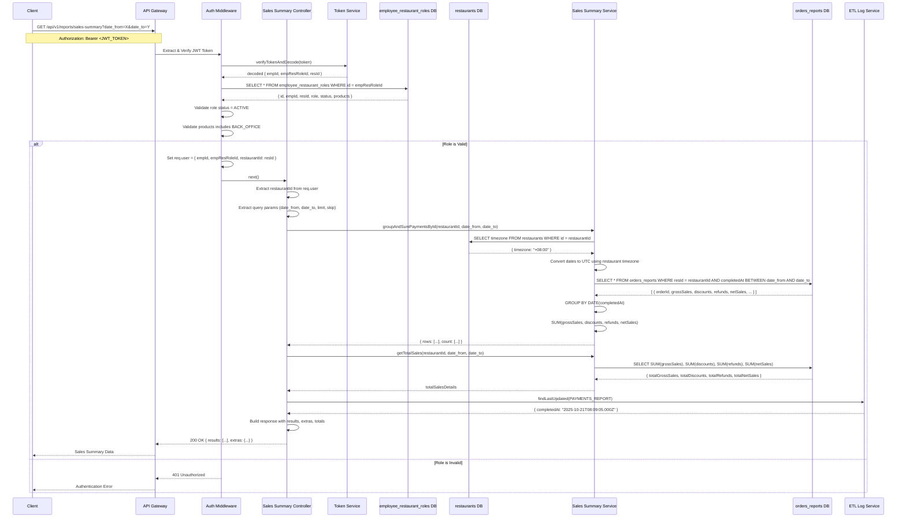
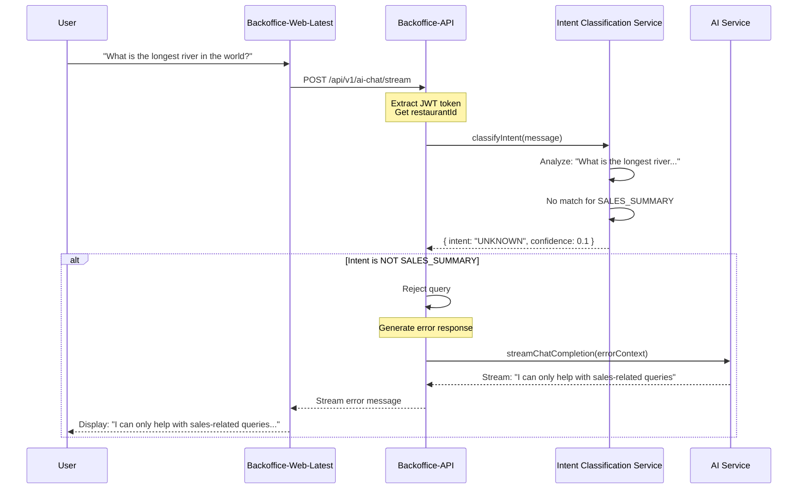
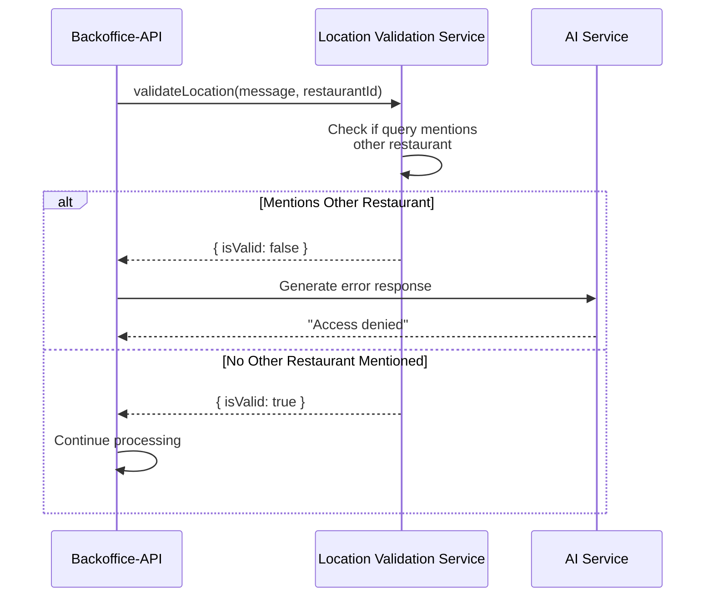
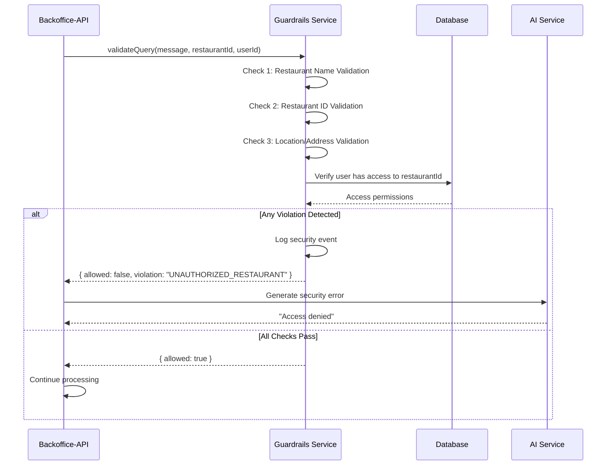
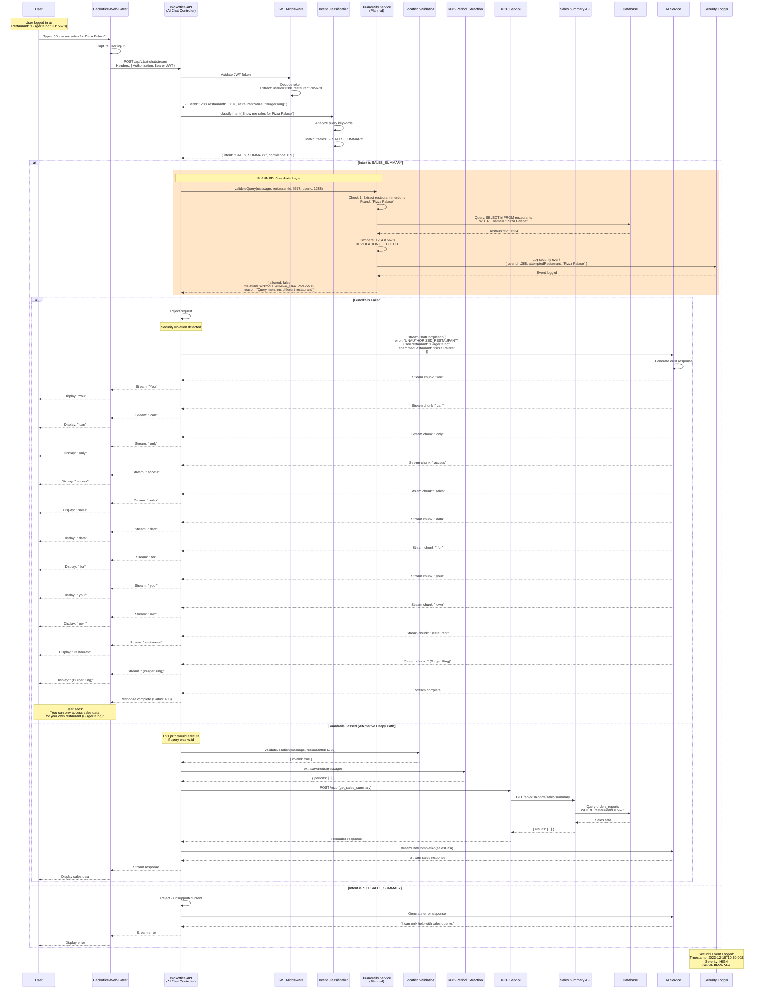
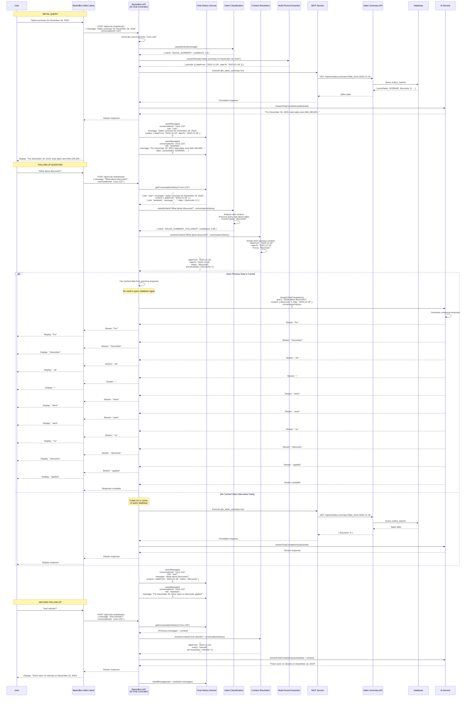
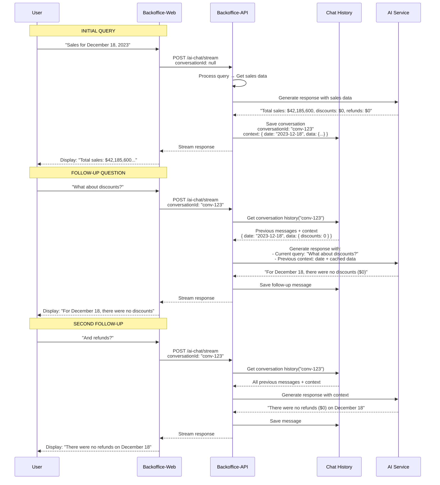
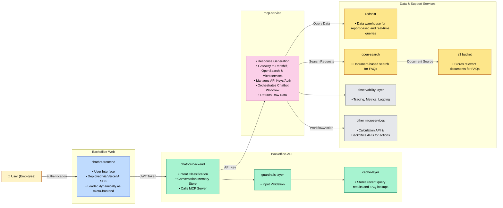

# Sales Summary API - Sequence Diagram

## Direct Sales Summary Request Flow



## Key Components

### 1. Authentication Flow
- JWT token extracted from Authorization header
- Token decoded to get `empResRoleId`
- Database queried to validate role status and permissions
- `restaurantId` extracted from role record

### 2. Sales Data Query
- Restaurant timezone fetched for date conversion
- Dates converted from local time to UTC
- Orders filtered by `restaurantId` and date range
- Data grouped by date and aggregated (SUM)

### 3. Response Structure
```json
{
  "results": [
    {
      "Date": "18-12-2023",
      "grossSales": "42185600",
      "discounts": "0",
      "refunds": "0",
      "netSales": "42185600"
    }
  ],
  "extras": {
    "date_from": "2023-12-18T00:00:00.000Z",
    "date_to": "2023-12-18T23:59:59.000Z",
    "lastUpdated": "2025-10-21T08:09:05.000Z",
    "total": 1,
    "totalSalesDetails": [
      {
        "totalGrossSales": "42185600",
        "totalDiscounts": "0",
        "totalRefunds": "0",
        "totalNetSales": "42185600"
      }
    ]
  }
}
```

## Database Tables

### employee_restaurant_roles
- `id` (empResRoleId) - Primary key
- `empId` - Foreign key to employees
- `resId` - Foreign key to restaurants
- `role` - User role (manager, cashier, etc.)
- `status` - ACTIVE/INACTIVE
- `products` - Comma-separated product access

### orders_reports
- `orderId` - Order identifier
- `resId` - Restaurant ID
- `completedAt` - Order completion timestamp
- `grossSales` - Total sales before discounts
- `discounts` - Total discounts applied
- `refunds` - Total refunds issued
- `netSales` - Final sales amount

### restaurants
- `id` - Restaurant ID
- `name` - Restaurant name
- `timezone` - Restaurant timezone offset
- `paymentProvider` - Payment provider (ADYEN, etc.)











